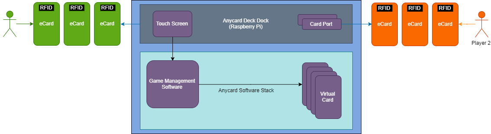
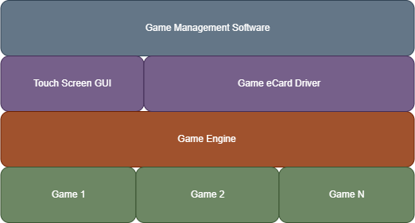

# Anycard ePlaying-cards
Hardware project for e-paper based playing card deck.

## Anycard Product Mission
Fun and new card game product that provides users the flexibility to play as many games as they wish with the use of just one digital card deck. 

## Target Users
Anyone that might enjoy a card game from ages 4-99+

## User Stories
* As a player, I want to be able to hold at least 4 digital cards in my hand.
* As a player, I want to be able to refresh a card without any latency.
* As a player, I want the ecard controller to keep track of my game score.
* As a player, I want the ecard controller to keep a history of game play.
* As a player, I want the ability to save an ongoing game state.
* As a player, I want the ecards to update to a different game in less than 5 seconds.
* As a player, I want to be able to play games of up to four people.
* As a player, I want to have an interface to setup games.

## Patent Implication
This idea has already been patented and the patent is now abandoned which makes this a public patent idea to be used by anyone. Althouhg options exist if specific technologies are implemented that give the product a new 

# System Design
The implementation of this product will be mainly through the use of e-paper displays to display each card value. This technology is the ideal candidate for this implementation as it is very low power and it mimics the look of ink on paper. The system will need a central computer to manage and store the card games, which will be implemented with the use of a small microcontroller or a single board computer enabled with a wifi, bluetooth or RFID module in order to communicate with the ecards. Please see the system design diagram below and a description of the product flow and of each component:

## E Cards Techonology
The electronic cards would be implemented using electronic paper, a technology that uses very low power consumption, is flexible and mimics the look of real paper. Electronic paper uses electronic ink which is comprised of millions of microcapsules that contain a positive or negative charge, the electronic paper

* Source: https://www.smartcity-displays.com/wp-content/uploads/2017/07/how-does-e-paper-work-1.gif

## Product Flow
At the start of a game, each player will have a number of cards that will initially be flushed or wiped out from any content. The player must then select a game to play using the user interface integrated into the Deck Dock, the player must place their cards within the card ports to shuffle their hand and the Deck Dock should provide the players with a unique set of cards according to the chosen game. As the players begin to play and a card needs to be drawn, players shall place the played card in the card port to refresh the card value to an unused card in the game.

## Deck Dock Controller
The application will have a Deck Dock controller which will be tasked with game management. The operations for game management are the following:
* Shuffle cards
* Deal cards
* Point calculations and distribution
* Game rules
* Game selection
* Score management
* Keep memory of card distribution and card graveyard
* Display information

### Card Port
The card port is the main interface between the ecards and the game Deck Dock controller. This interface will server as a power supply and I/O interface for the ecards in order to give each card a new value.

### User Interface
The UI will be implemented through a touch screen integrated within the Deck Dock. The interface first servers as a means for the user to select their game, game preferences, player selection and other game settings.

## Players
In the system design below notice Player 1 and Player 2 are shown with ecards representing the hand for each player. The ecards will be equipped with an RFID tag which will be used by the Anycard Deck Dock to identify the card that was played and what card value it contains. The players will need to interface with the card port in order to refresh the cards and continue game play.

## Software Stack
The software within the application will be tasked with managing the game while at the same time communicating with the ecard interface in order to properly account for game score and card values.

# Software Design
The software implementation will consist of two main components as shown below: the GUI and the eCard driver. The GUI component will be implemented initially as a touch screen interface integrated with the Deck Dock

## MVP
The basic and minimum need for this product is to have a method of refreshing cards without latency and update the digital deck of at least 4 electronic cards without latency. The functionality shall be seamless as it would be when using a normal paper card deck. The end goal is to have wireless functionality between the digital card deck
